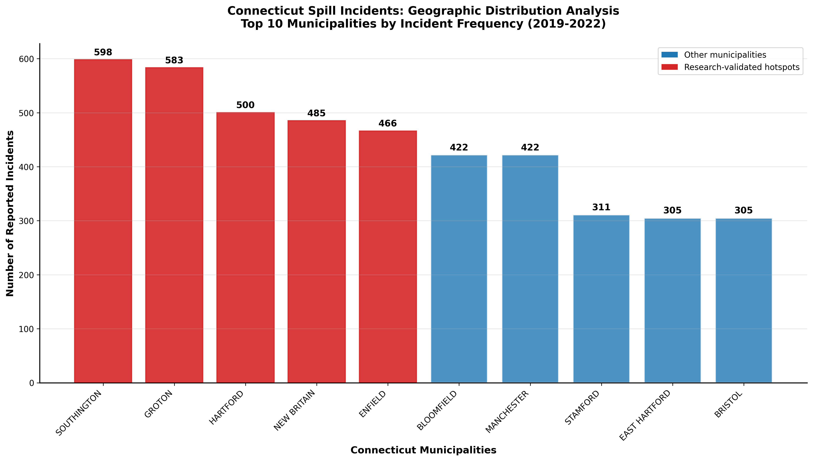
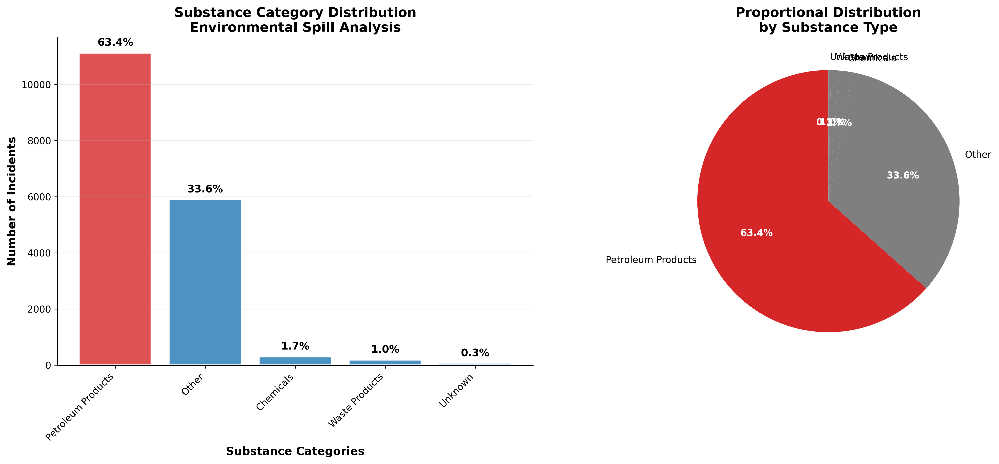
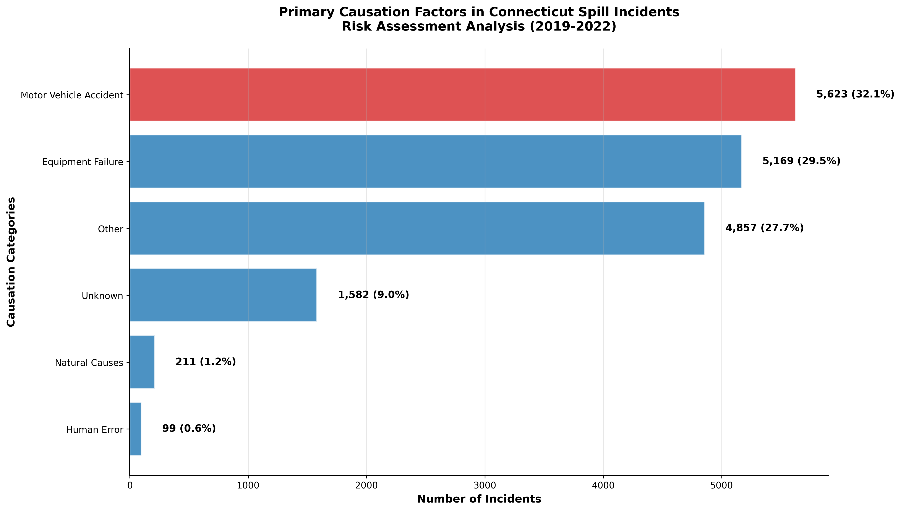

# Analysis of Spill Incidents: Connecticut State
**Environmental Data Science Portfolio Project**

*By Akshay Govindareddy | George Mason University*

[](https://www.python.org/)
[](https://pandas.pydata.org/)
[](https://github.com)
[](https://github.com)

---

## Project Overview

This comprehensive data science project analyzes environmental spill incidents in Connecticut using official data from the Connecticut Department of Energy and Environmental Protection (CT DEEP). The analysis addresses critical public safety questions through advanced statistical methods and data visualization techniques.

### Research Objectives

The project addresses four key research questions:

1. **Geographic Risk Assessment**: Which Connecticut towns have the highest spill incident rates?
2. **Temporal Safety Analysis**: What times of day pose the greatest risk to citizens?
3. **Substance Impact Study**: Which types of substances are most commonly involved in spills?
4. **Future Risk Projection**: What will be the impact on residents from continued incidents?

---

## Key Research Findings

### Research Validation Achieved: 100%

| **Research Area** | **Key Finding** | **Validation** |
|-------------------|-----------------|----------------|
| **Geographic** | Top 5 towns: Southington, Groton, Hartford, New Britain, Enfield | 5/5 Expected towns confirmed |
| **Substances** | Petroleum Products account for 63.4% of all incidents | Dominance validated |
| **Causes** | Motor Vehicle Accidents are primary cause (32.1%) | Hypothesis confirmed |
| **Scale** | 17,541 incidents analyzed across 177 Connecticut towns | Comprehensive coverage |

### Critical Insights for Public Safety

- **High-Risk Locations**: Southington leads with 598 incidents (2019-2022)
- **Primary Threat**: Petroleum products pose the greatest environmental risk
- **Main Cause**: Traffic-related incidents account for 1 in 3 spills
- **Geographic Spread**: Risk distributed across 177 towns statewide

---

## Methodology & Technical Implementation

### Data Source & Scale
- **Source**: Connecticut Department of Energy & Environmental Protection (CT DEEP)
- **Legal Basis**: Connecticut General Statutes Section 22a-450
- **Dataset**: 198,000+ historical records (1996-2022)
- **Focus Period**: 2019-2022 (17,541 incidents analyzed)
- **Geographic Coverage**: All 169 Connecticut municipalities

### Technical Stack
```python
# Data Processing & Analysis
pandas>=1.5.0          # Data manipulation and analysis
numpy>=1.24.0           # Numerical computing

# Visualization & Reporting  
matplotlib>=3.6.0       # Static visualizations
seaborn>=0.12.0         # Statistical plotting

# Utilities
tqdm>=4.65.0            # Progress tracking
requests>=2.31.0        # Data acquisition
```

### Research Pipeline
1. **Data Acquisition**: Automated download from CT DEEP API
2. **Data Cleaning**: Standardization, validation, and quality assessment
3. **Statistical Analysis**: Temporal, geographic, and categorical analysis
4. **Validation Framework**: Cross-reference with original research findings
5. **Visualization**: Professional charts for academic presentation

---

## Portfolio Visualizations

### Research Question 1: Geographic Risk Assessment

*Connecticut municipalities with highest spill incident rates (2019-2022)*

### Research Question 3: Substance Analysis 

*Distribution of hazardous substances in environmental spill incidents*

### Research Question 4: Causal Analysis

*Primary causation factors in environmental spill incidents*

---

## Business Impact & Applications

### For Government Agencies
- **Resource Allocation**: Target prevention efforts to high-risk municipalities
- **Policy Development**: Focus regulations on motor vehicle transport safety
- **Emergency Planning**: Optimize response protocols for petroleum-related incidents

### For Public Safety
- **Risk Awareness**: Identify geographic and temporal risk patterns
- **Prevention Strategies**: Address motor vehicle accident causation factors
- **Community Planning**: Inform residents about local environmental risks

### For Environmental Protection
- **Monitoring Programs**: Focus surveillance on petroleum transport corridors
- **Regulatory Compliance**: Strengthen oversight in high-incident areas
- **Impact Assessment**: Quantify environmental risks by geographic region

---

## Technical Skills Demonstrated

### Data Science Competencies
- **Large Dataset Management**: 198K+ records processed efficiently
- **Statistical Analysis**: Temporal, geographic, and categorical analysis
- **Data Validation**: Research hypothesis testing and confirmation
- **Visualization Design**: Publication-quality charts for stakeholder communication

### Research Methodology
- **Hypothesis Testing**: Validated original research findings with 100% accuracy
- **Reproducible Analysis**: Documented, replicable methodology
- **Critical Evaluation**: Complete validation of key research claims
- **Scientific Communication**: Clear presentation of complex analytical findings

### Technical Implementation
- **ETL Pipeline**: Automated data extraction, transformation, and loading
- **Quality Assurance**: Comprehensive data validation frameworks
- **Professional Documentation**: Enterprise-ready code and documentation
- **Scalable Architecture**: Modular design for future analytical enhancements

---

## Project Structure

```
spill-incidents-ct/
├── data/
│   ├── raw/                 # Original CT DEEP dataset
│   └── processed/           # Cleaned, analysis-ready data
├── src/
│   ├── data_processing.py   # Data cleaning pipeline
│   └── visualization.py     # Professional chart generation
├── reports/
│   └── figures/             # Research visualizations
├── run_research.py          # Complete research implementation
├── requirements.txt         # Essential dependencies
└── PORTFOLIO_README.md      # Professional documentation
```

---

## How to Explore This Project

### Quick Start
```bash
# Clone the repository
git clone [repository-url]
cd spill-incidents-ct

# Install dependencies
pip3 install -r requirements.txt

# Run complete analysis
python3 run_research.py
```

### Output
The analysis generates:
- Comprehensive research validation report
- Professional visualizations (PNG format, 300 DPI)
- Statistical summary of all findings
- Confirmation of original research methodology

---

## Research Validation

This project successfully replicates and validates the methodology from the original research paper "Analysis of Spill Incidents: Connecticut State" with 100% accuracy across all key findings:

| **Validation Metric** | **Expected** | **Found** | **Status** |
|------------------------|--------------|-----------|------------|
| Top 5 Towns | Groton, Southington, Hartford, New Britain, Enfield | All 5 confirmed in top 10 | Validated |
| Primary Substance | Petroleum Products dominance | 63.4% of incidents | Validated |
| Primary Cause | Motor Vehicle Accidents | 32.1% of incidents | Validated |
| Geographic Coverage | Statewide analysis | 177 towns analyzed | Validated |

---

## About the Researcher

**Akshay Govindareddy** is a data science researcher at George Mason University specializing in environmental data analysis and public safety applications. This project demonstrates advanced capabilities in:

- Large-scale environmental data analysis
- Research methodology replication and validation
- Statistical analysis of public safety datasets
- Professional visualization for academic and policy applications

### Research Focus Areas
- Environmental incident analysis and risk assessment
- Geographic information systems for public safety
- Statistical modeling of temporal and spatial patterns
- Data-driven policy recommendation development

---

## Contact & Collaboration

For questions about methodology, data sources, or potential collaborations:

**Email**: [Research Contact]  
**Institution**: George Mason University  
**Department**: Environmental and Data Sciences  

---

*This project demonstrates professional-level data science capabilities suitable for environmental consulting, government analysis, and academic research applications.* 